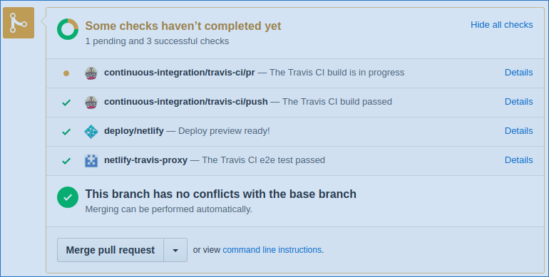
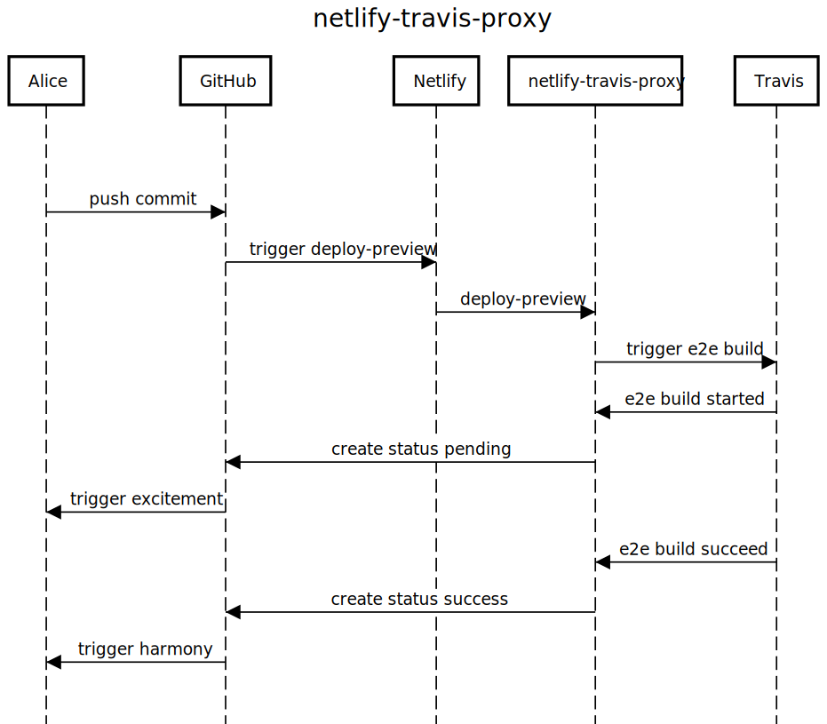

# netlify-travis-proxy [](https://travis-ci.org/kontrollanten/netlify-travis-proxy) [](https://codecov.io/github/kontrollanten/netlify-travis-proxy?branch=master)

[Serverless](https://serverless.com) glue proxy for calling [Travis](https://travis-ci.org) upon [Netlify](https://netlify.com) deployment.



## Why?
Makes it easy to run e2e tests after [Netlify deployment preview](https://www.netlify.com/blog/2016/07/20/introducing-deploy-previews-in-netlify/) is generated.

## How?
Typical workflow:
1. Netlify deployment is triggered upon creating/updating pull request
2. `netlify-travis-proxy` is called after Netlify deployment
3. `netlify-travis-proxy` triggers a Travis build to perform e2e tests



## Getting started
```
git clone git@github.com:kontrollanten/netlify-travis-proxy.git
cd netlify-travis-proxy
yarn
cp .env.example .env # Open and fill your configuration
cp example.config.dev.json config.dev.json # Open and fill your configuration
yarn deploy
```

[Add a Netlify deploy notification](https://www.netlify.com/docs/webhooks/#outgoing-webhooks-and-notifications) with the URL provided from `yarn deploy`.
Additionaly you can [add support for GitHub statuses](#github-statuses).

## Target repo .travix.yml example
Since Travis [doesn't support reading env vars for conditional builds from the API call](https://docs.travis-ci.com/user/conditional-builds-stages-jobs#Specifying-conditions), we have to use `type = api` for conditional checks.

```
- stage: lint
  if: type != api
  script: yarn lint
- stage: test
  if: type != api
  script: yarn test && codecov
- stage: e2e
  if: type = api
  script: yarn install-selenium && yarn e2e
```

## GitHub statuses
By adding webhook notifications to your target repo .travis.yml you can create statuses for the corresponding git commit.

The webhook will search for stage e2e in the triggering build. **If stage e2e isn't found, no status will be created.**

```
notifications:
  webhooks:
    urls:
      - https://fdyg78nn.execute-api.eu-west-1.amazonaws.com/dev/github-status # endpoint provided from *yarn deploy*
    on_start: always    # will create GH status `pending`
    on_success: always  # will create GH status `success`
    on_failure: always  # will create GH status `failure`
    on_cancel: always   # will create GH status `failure`
    on_error: always    # will create GH status `error`
```

## Limitations
Works only for AWS for the moment. It's possible to configure the serverless.yml file to use other providers.
